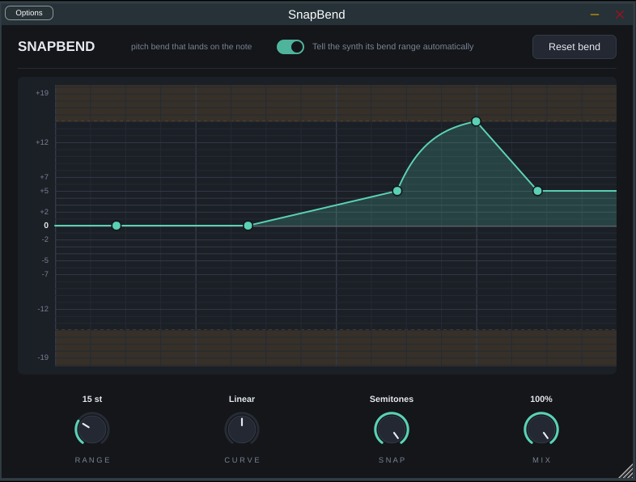
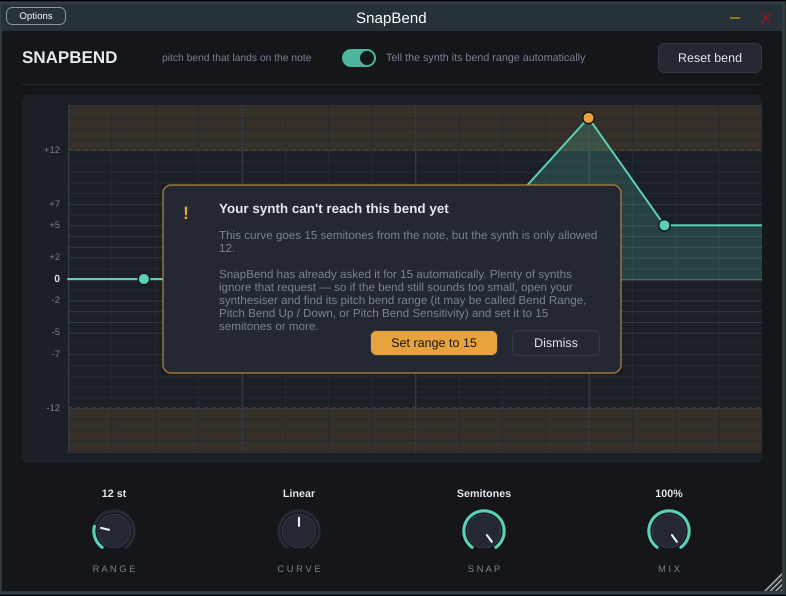

# SnapBend

A pitch bend plugin for Logic Pro where the bends land on actual semitones.

You draw a line on a grid. The grid's horizontal lines are semitones, and the
points you drop snap onto them — so "up a fifth" is genuinely up a fifth, not
somewhere in the region of a fifth. Drag the line between two points to curve
the slide, the same gesture as Logic's own automation.



When a bend goes past what the synth has been allowed, it says so:



## What it is, technically

An **Audio Unit MIDI FX plugin**. It goes in the *MIDI FX* slot at the top of a
software instrument channel strip — above the synth, not in the audio chain —
and rewrites the MIDI on its way past, adding pitch bend that follows your
curve.

You still write your notes in Logic's own piano roll. SnapBend does not replace
it and cannot: Logic exposes no way for a plugin to touch its editor.

## Why bends usually go wrong, and what this does about it

Nearly every synth ignores large bends unless you ask permission first. Out of
the box the MIDI standard allows **±2 semitones**, so a drawn 7-semitone bend
comes out around 1.2 and the plugin looks broken.

SnapBend transmits an **RPN 0,0 (Pitch Bend Sensitivity)** message to set the
synth's range before it sends anything, and re-sends it whenever playback starts
or the range changes. If you drag a bend past what the synth has been allowed,
a prompt appears telling you — in plain words — to go and raise the range in the
synth itself, with a button that widens SnapBend's own setting to match.

The other classic failures are handled too:

| Failure | What SnapBend does |
| --- | --- |
| Synth left detuned after pressing stop | Returns bend to centre on stop, bypass and panic |
| Stepped, zippery slides | 14-bit bend on a 1 ms grid with sample-accurate offsets |
| Bounce sounds different to playback | Everything is derived from the host's musical position, never wall-clock |
| Bend range silently re-written by something else | The RPN sequence is closed with RPN Null |
| Region's own bend fighting the plugin's | Incoming pitch bend is filtered out; SnapBend owns the channel |

## The controls

| Knob | What it does |
| --- | --- |
| **RANGE** | How far the synth is allowed to bend, 1–48 semitones. Also what gets transmitted to the synth. |
| **CURVE** | Leans every slide towards moving early or late, without editing any points. |
| **SNAP** | Fully clockwise locks to whole semitones. Anticlockwise loosens it, for bends that deliberately sit just under the note. |
| **MIX** | Scales the whole effect, 0% to 100%. |

**Tell the synth its bend range automatically** — leave this on unless you have
a synth that mishandles RPN and you would rather set its range by hand.

**Reset bend** — sends the synth back to normal pitch, if anything is ever left
hanging.

### Editing

- **Click** empty space to add a point
- **Drag** a point to move it (snapping to semitones and to the beat grid)
- **Drag the line** between two points to curve the slide
- **Double-click** a point to remove it
- **Hold Alt** while dragging to ignore the grid entirely

## Building it

You need a Mac with **Xcode** installed (it is free from the App Store). Audio
Units only exist on macOS, so this is the one step that cannot happen anywhere
else.

```bash
cd snapbend
cmake -B build -G Xcode -DSNAPBEND_BUILD_PLUGIN=ON
cmake --build build --config Release
```

The first run downloads JUCE, which takes a few minutes. When it finishes, the
plugin has already been copied to
`~/Library/Audio/Plug-Ins/Components/SnapBend.component`.

### Then, in Logic

1. Restart Logic if it was open — it scans for plugins at launch.
2. Make a **software instrument** track and load any synth.
3. At the very top of the channel strip, click the **MIDI FX** slot.
4. Choose **SnapBend** (under the SnapBend manufacturer heading).

If it does not appear, Logic has failed it in validation. Run
`auval -v aumi Snb1 Snpb` in Terminal to see why. You may also need to open
**Logic Pro → Settings → Plug-in Manager** and reset the scan.

### Not wanting to touch Xcode at all

Push to GitHub and the included workflow (`.github/workflows/snapbend.yml`)
builds the Audio Unit on a free macOS runner and attaches
`SnapBend.component` as a downloadable artifact. Unzip it into
`~/Library/Audio/Plug-Ins/Components/` and restart Logic.

Because it is not signed by an Apple Developer account, macOS may block it the
first time. Right-click the `.component` in Finder and choose **Open**, or
allow it under **System Settings → Privacy & Security**.

## Running the tests

The bend engine is plain C++ with no dependencies, so its tests run anywhere —
no Mac, no DAW, no JUCE:

```bash
cd snapbend
cmake -B build -DSNAPBEND_BUILD_PLUGIN=OFF
cmake --build build
ctest --test-dir build --output-on-failure
```

Every test corresponds to a real way pitch bend goes wrong: wrong range, stepped
slides, a synth left detuned, a bounce that does not match playback.

## Layout

```
snapbend/
  core/          the engine — no JUCE, no dependencies, fully testable
    BendCurve    the curve model, snapping and shaped interpolation
    BendMath     14-bit conversion and the RPN range handshake
    BendEmitter  turns curve + transport position into MIDI
  plugin/        the JUCE Audio Unit
    ui/          the bend lane, the range prompt, the knobs
  tests/         core tests
```

## What is not here yet

- **MPE mode** — per-note bends, so one note in a chord can move on its own.
  Normal MIDI bend is channel-wide, so today a chord bends as a block.
- **An audio version** — pitch shifting the synth's output rather than bending
  its MIDI, for vocals and samples. The curve engine is already shared-ready.
- **Presets** for common bend shapes.

## Cost

Nothing. JUCE's free tier covers this, Xcode is free, and GitHub's macOS runners
are free on public repositories. An Apple Developer account ($99/yr) is only
needed to distribute a signed build to other people — not to use it yourself.
